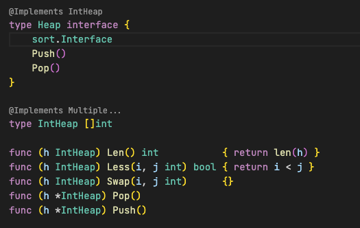

# Go Interface Annotations

A very WIP extension that adds some visual marks (and navigation) between interfaces and structs.
I really liked the way JetBrains' GoLand shows when interfaces are being implemented or when structs follow some implement interfaces. Since Go has no "X implements Y" syntax, sometimes it gets hard to see at a glance what you're working with.

Download the extension from [VS Code Extension Marketplace](https://marketplace.visualstudio.com/items?itemName=galkowskit.go-interface-annotations).

